# Apple Developer Account Registration

> **Document preview:** To preview this Markdown document in Visual Studio Code, press `Ctrl + Shift + V`.

This guide explains how to create an Apple Account and enroll in the Apple Developer Program as an individual developer.

## 1. Open the Apple registration page

Go to the following page:

https://developer.apple.com/register/

We recommend registering with a Gmail address. The same email address may also be used later to manage the Google Play Console account for the Android application.


Click **Continue** to proceed.


## 2. Create an Apple Account

If you do not already have an Apple Account, click **Create Your Apple Account**.

You will be redirected to the account registration form.


Complete the form with the requested personal information.

This account will initially be a standard Apple Account. After it has been created and verified, it will be used to enroll in the Apple Developer Program.

Apple may require you to verify the account using:

- A verification code sent to your email address.
- A verification code sent to your phone number.

Complete all the required verification steps before continuing.

## 3. Enroll in the Apple Developer Program

After creating and verifying the Apple Account, proceed with the Apple Developer Program enrollment.

You should be redirected to the following page:


If you are not redirected automatically, go to:

https://developer.apple.com/account

Sign in using the Apple Account you created in the previous steps.

You will then be asked to provide your personal information as a developer.


> **Important:** Make sure all the information matches your legal identification documents.

The developer or seller name displayed on the App Store depends on the selected account type. With an individual membership, the developer’s legal name is generally displayed instead of a company name.

## 4. Select the entity type

When asked to select an entity type, choose **Individual / Sole Proprietor**.


### Organization enrollment reference

For reference, the following screens show the information requested when enrolling as a company or organization.


An organization enrollment generally requires additional company information and verification. Do not select this option unless the developer account must be registered under a legally recognized organization.

## 5. Review the enrollment summary

After completing the individual enrollment form, Apple will display a summary of the account and enrollment information.


Carefully review the information before continuing. In particular, verify:

- Your full legal name.
- Your address and contact information.
- The selected entity type.
- The email address associated with the Apple Account.

## 6. Pay for the membership

After confirming the enrollment information, Apple will display a blue button to continue with the Apple Developer Program membership payment.

The membership must be renewed annually to keep the developer account active and continue distributing applications through the App Store.

Follow Apple’s payment instructions to complete the enrollment process.

> **Note:** Account verification and enrollment approval may not be immediate. Apple may request additional information before activating the developer membership.

# iOS / App Store Configuration

This guide describes the steps required to configure an iOS React Native application for development, code signing, archiving, and TestFlight distribution.

The configuration is divided into two main parts:

1. **Apple Developer Account** — Register the application and development device.
2. **Xcode** — Configure signing, versioning, and create an archive for TestFlight.

---

## 1. Apple Developer Account

### 1.1 Access the Apple Developer Account

Go to the [Apple Developer Account](https://developer.apple.com/account).

---

### 1.2 Register the App ID

Before configuring the application in Xcode, an **App ID** must be registered in the Apple Developer account.

Navigate to:

**Certificates, IDs & Profiles → Identifiers**

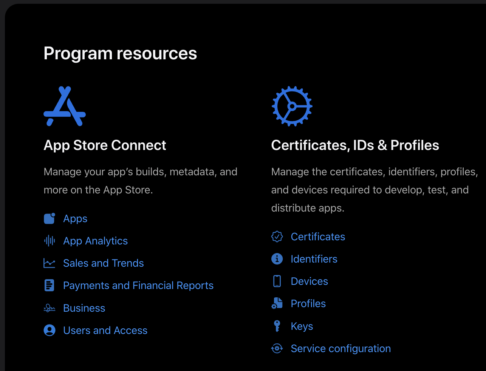

Click the **+** button to create a new identifier.

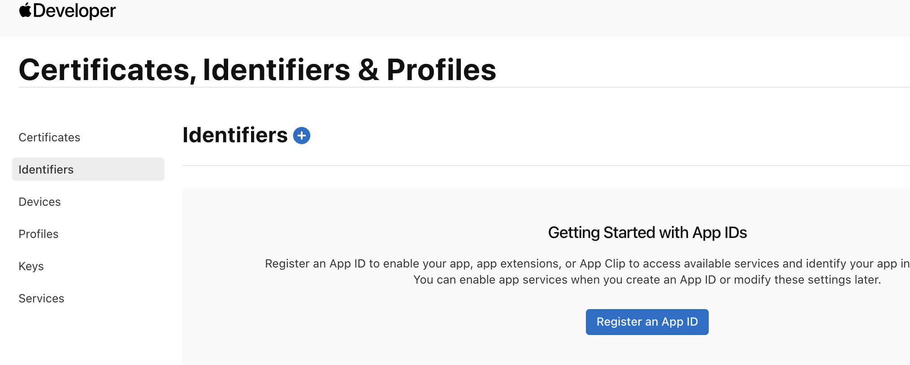

Select **App IDs** and continue.

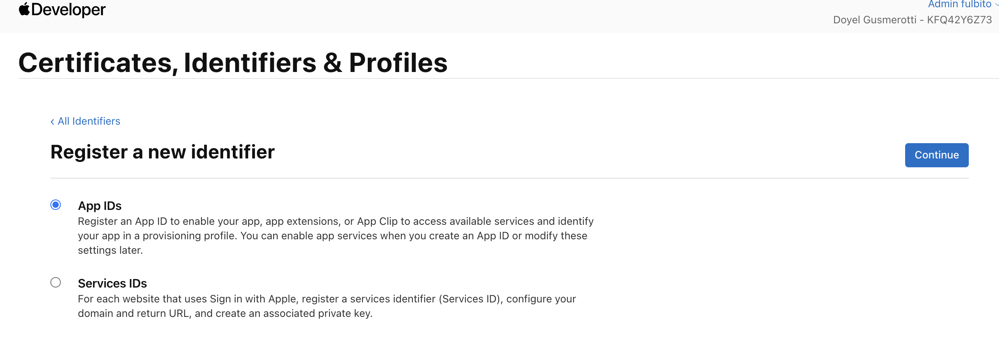

Then, select **App** as the application type and click next.

Provide the following information:

- **Description:** A descriptive name for the application.
- **Bundle ID:** The unique Bundle Identifier used by the application.

The Bundle ID must be unique, we will use it as the "Bundle Identifier" field in Xcode.

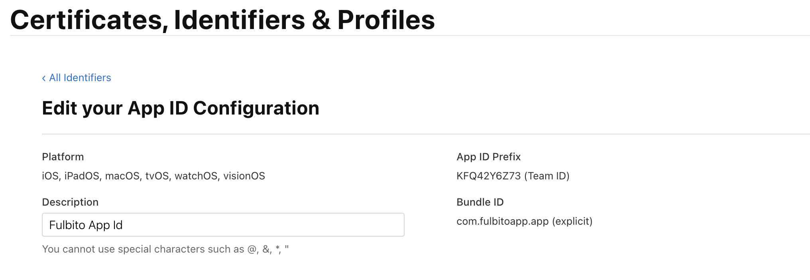

After verifying the information, click **Register**.

---

## 2. Register a Development Device

At least one physical iOS device must be registered in the Apple Developer account for development and signing purposes.

For this project, an old **iPhone 6s** was registered as the development device.

### 2.1 Open the Devices Section

Navigate to:

**Certificates, IDs & Profiles → Devices**

Click the **+** button to register a new device.

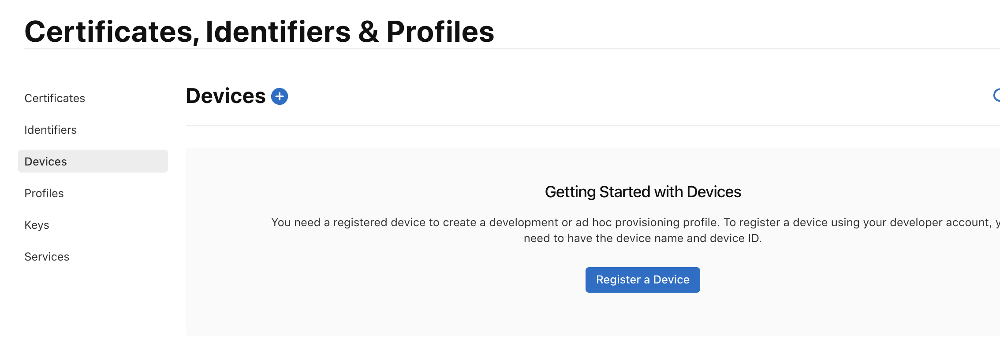

---

### 2.2 Register the Device

Select the appropriate platform and enter the required device information.

The most important value is the device's **UDID (Unique Device Identifier)**.

The UDID can be obtained by connecting the iPhone to a Mac and checking the device information through Finder or Xcode.

Or in the device we can go to Configuration -> General -> information -> SEID.

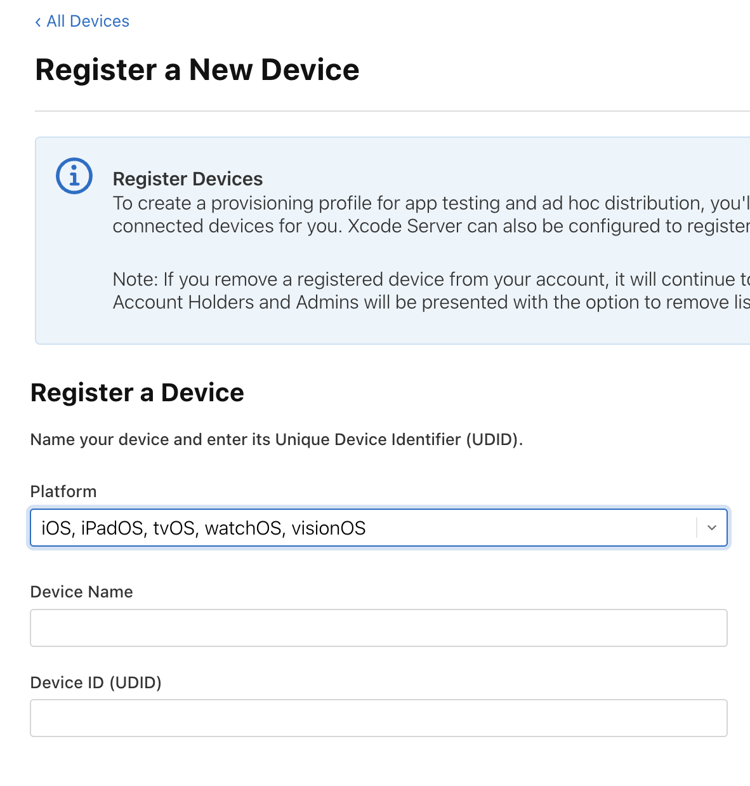

> **Important:** The development device must be registered in the Apple Developer account before Xcode can use it for development signing.

---

# 3. Xcode Configuration

## 3.1 Open the iOS Project

Open the project's `ios` directory in Xcode.

In the Project Navigator on the left side of Xcode, select the application target, in this case **Mobile**.

The project configuration will then be displayed on the right side of Xcode.

---

## 3.2 Configure Signing & Capabilities

Select:

**Signing & Capabilities**

Make sure that the **Bundle Identifier** matches the App ID previously registered in the Apple Developer account.

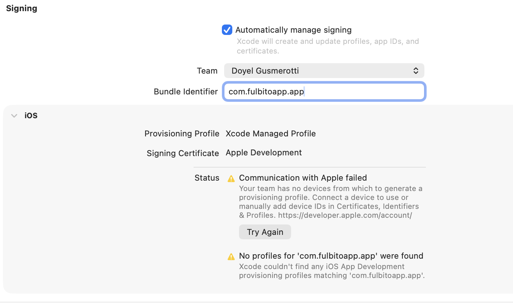

Verify the following configuration:

- **Team:** The appropriate Apple Developer team.
- **Bundle Identifier:** The Bundle ID registered in Apple Developer.
- **Automatically manage signing:** Enabled, unless the project requires manual signing configuration.

Xcode should then be able to generate and manage the appropriate provisioning configuration.

> **Note:** If no development device has been registered, Xcode may display a signing or provisioning error. In that case, a TestFlight build cannot be created until the required development device and signing configuration are available.

---

# 4. Application Version and Build Number

## 4.1 Configure the Version

In Xcode, open the **General** tab for the application target.

The application **Version** and **Build** numbers can be configured here.

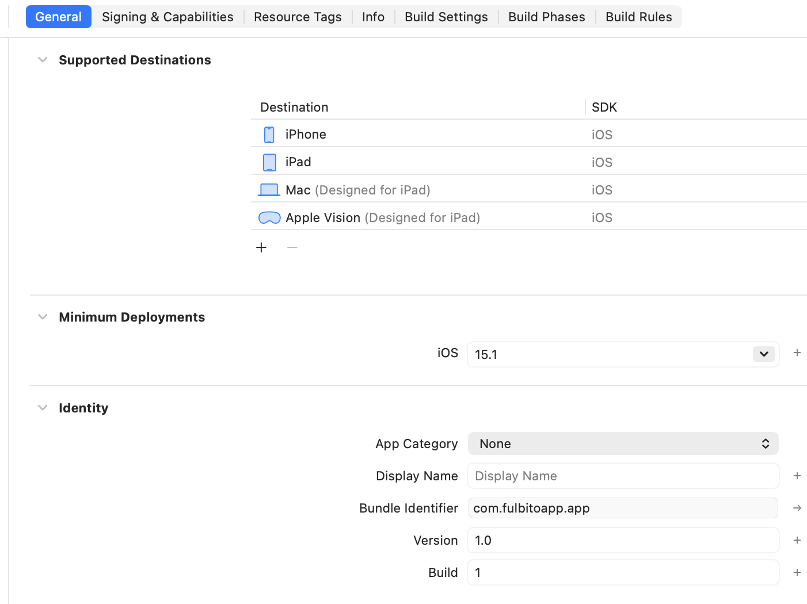

The **Version** represents the public version of the application.

For example:

```text
1.0.0
```

### Version Number Rules

The Version number should remain unchanged while uploading different builds of the same release.

For example:

```text
Version: 1.0.0
Build:   1
```

If a new build is required for the same version:

```text
Version: 1.0.0
Build:   2
```

The Version should only be updated when a new application version is released.

For example:

```text
Version: 1.0.0 → Build: 1
Version: 1.0.0 → Build: 2
Version: 1.0.0 → Build: 3

New release:

Version: 1.1.0 → Build: 1
```

---

## 4.2 Configure the Build Number

The **Build** number identifies a specific build of the application.

The Build number must be incremented **every time a new build is uploaded to TestFlight/App Store Connect for the same Version**.

For example:

```text
Version: 1.0.0
Build:   1
```

After making another change:

```text
Version: 1.0.0
Build:   2
```

And the next upload:

```text
Version: 1.0.0
Build:   3
```

> **Important:** App Store Connect requires each uploaded build to have a unique build number for the same version.

---

# 5. Create and Distribute an Archive

Once the application has been properly configured and signed, an archive can be created for distribution through App Store Connect and TestFlight.

## 5.1 Create an Archive

In Xcode, select:

**Product → Archive**

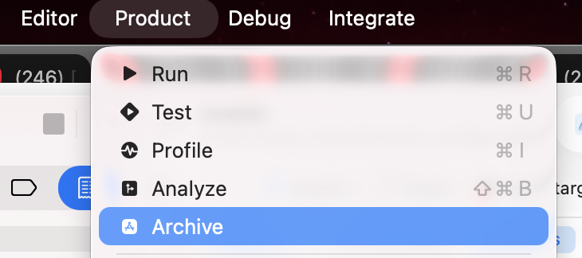

Xcode will compile the application and create an **Archive**.

If the archive is created successfully, Xcode will open the **Organizer** window with the newly created build.

---

## 5.2 Distribute the Build

In the Xcode **Organizer**, select the archive you want to upload and click:

**Distribute App**

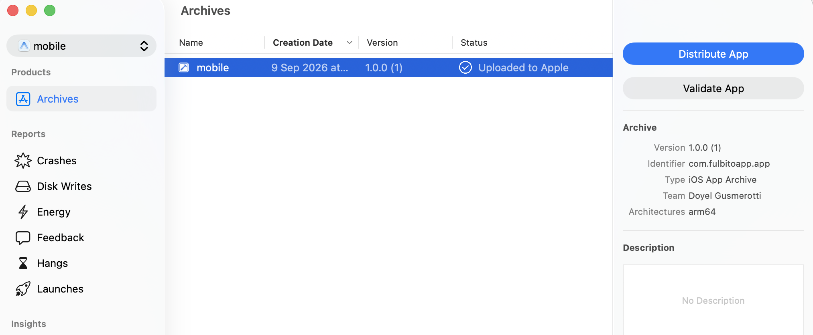

Follow the distribution wizard and select the appropriate distribution method for the project.

Xcode will validate the archive and upload the build to **App Store Connect**.

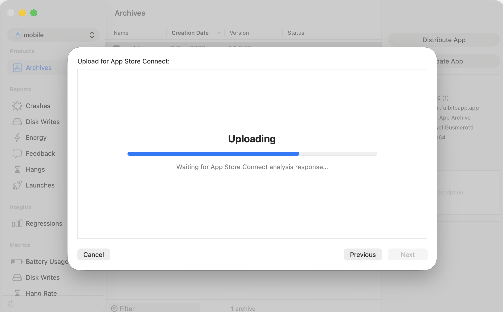

Wait for the upload and processing process to complete.

> **Note:** The upload process may take several minutes depending on the size of the application and the network connection.

---

## 5.3 TestFlight Availability

After the build has been successfully uploaded, Apple needs to process the build before it becomes available in **TestFlight**.

In most cases, the build may become available within approximately **15–30 minutes**, although processing times can vary.

Once processing is complete, the build can be found in:

**App Store Connect → My Apps → [Your App] → TestFlight**

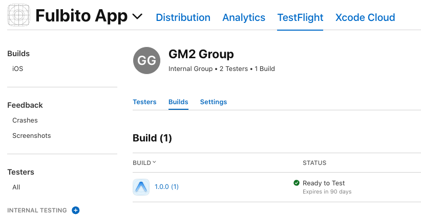

From there, the build can be assigned to the appropriate **Testers** or **Test Groups**.

> **Important:** The build must finish processing successfully before it can be distributed to testers. If Apple detects an issue during processing, the build may appear with a processing or validation error that must be resolved before distribution.

# 6. Troubleshooting

## 6.1 `Undefined symbol: facebook::react::Sealable::Sealable()`

When attempting to create a TestFlight archive, you may encounter an error similar to:

```text
Undefined symbol: facebook::react::Sealable::Sealable()
```

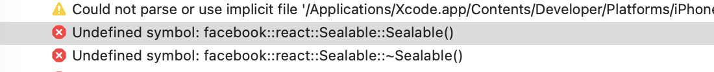

This can sometimes be caused by stale Xcode build artifacts or cached files.

### Step 1 — Remove DerivedData

Run the following command from the terminal:

```bash
rm -rf ~/Library/Developer/Xcode/DerivedData
```

### Step 2 — Clean the Build Folder

In Xcode, select:

**Product → Clean Build Folder**

### Step 3 — Create the Archive Again

After cleaning the project, try creating the archive again:

**Product → Archive**

> **Note:** Clearing `DerivedData` and performing a clean build can resolve issues caused by stale or incompatible build artifacts.
