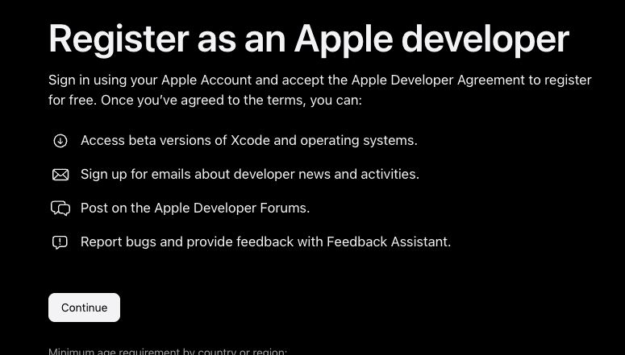
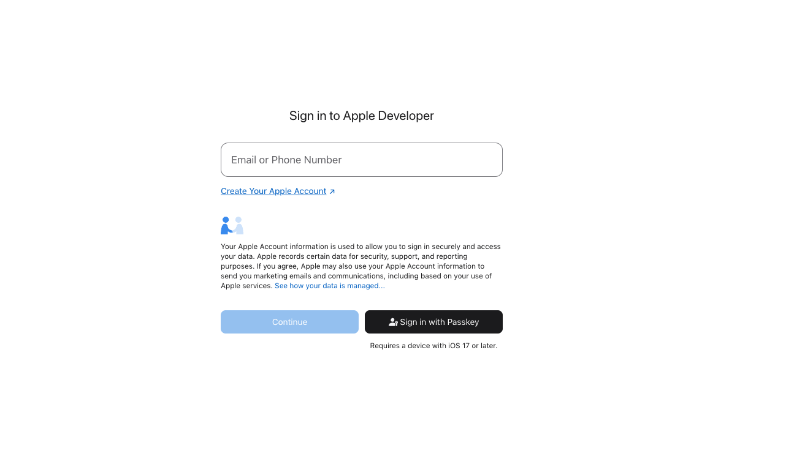
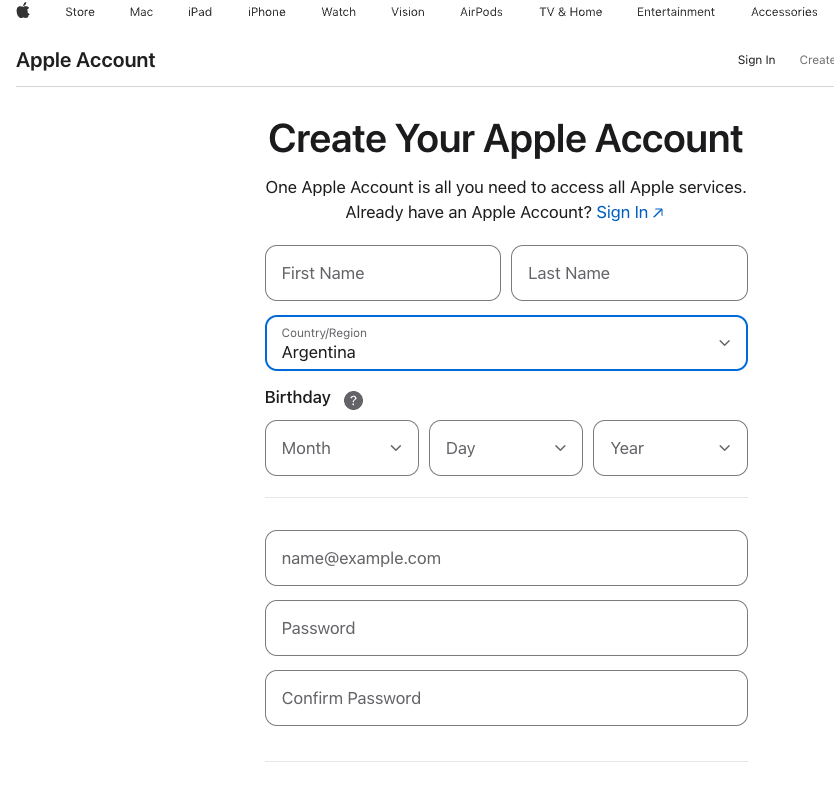
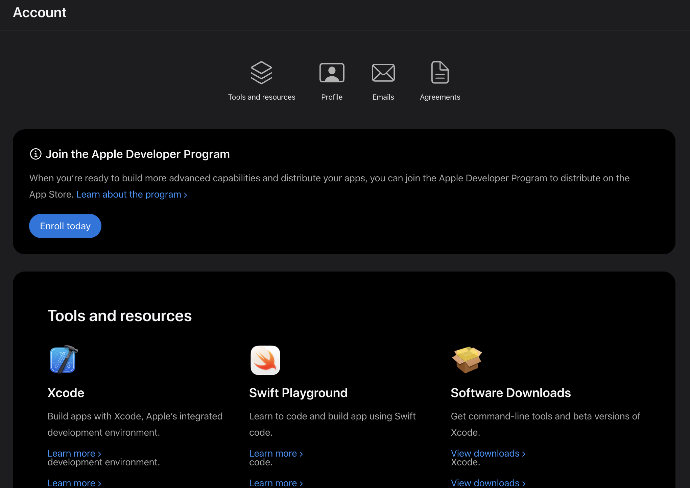
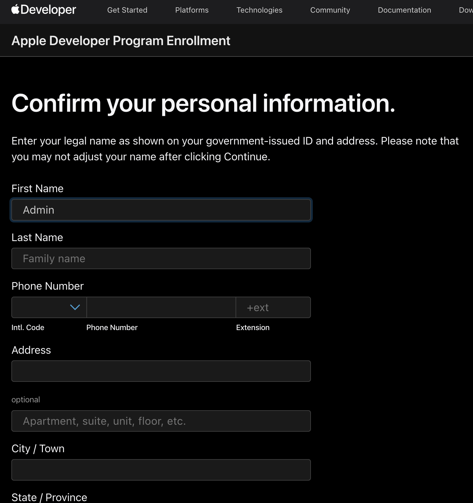
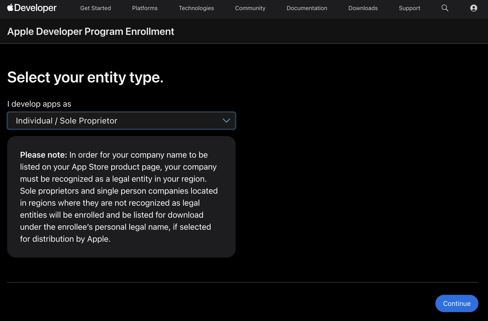
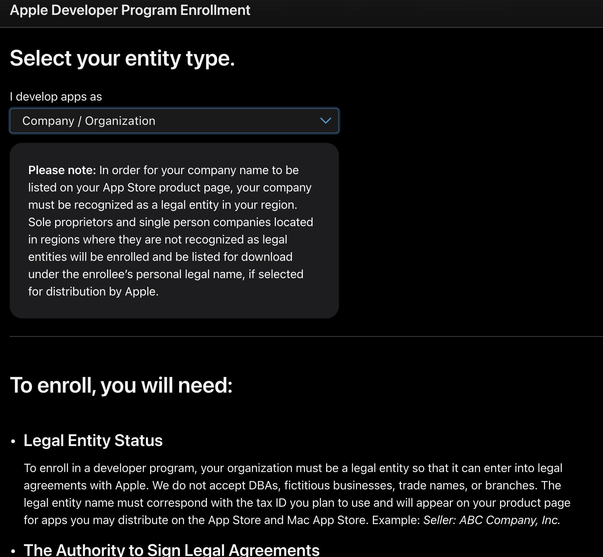
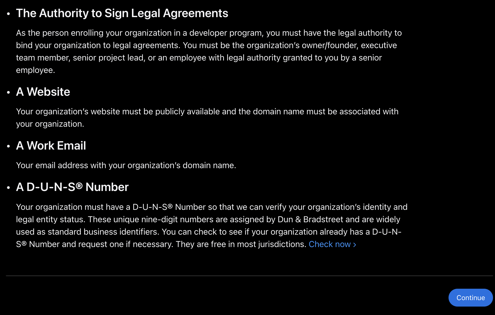
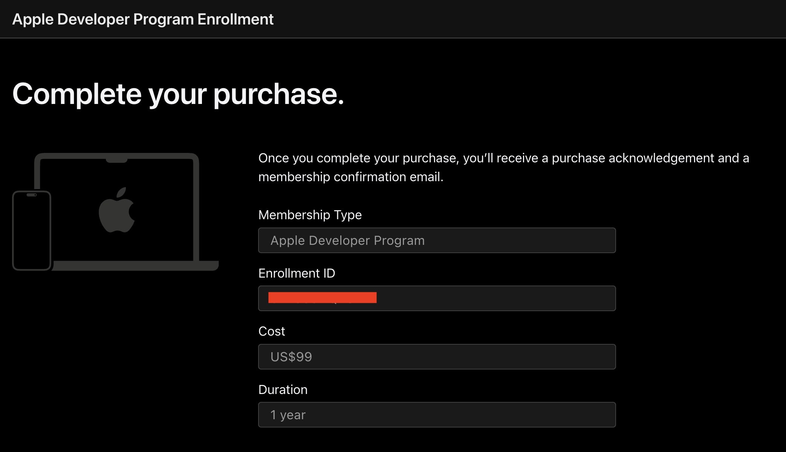

# Apple Developer Account Registration

> **Document preview:** To preview this Markdown document in Visual Studio Code, press `Ctrl + Shift + V`.

This guide explains how to create an Apple Account and enroll in the Apple Developer Program as an individual developer.

## 1. Open the Apple registration page

Go to the following page:

https://developer.apple.com/register/

We recommend registering with a Gmail address. The same email address may also be used later to manage the Google Play Console account for the Android application.

Click **Continue** to proceed.

## 2. Create an Apple Account

If you do not already have an Apple Account, click **Create Your Apple Account**.

You will be redirected to the account registration form.

Complete the form with the requested personal information.

This account will initially be a standard Apple Account. After it has been created and verified, it will be used to enroll in the Apple Developer Program.

Apple may require you to verify the account using:

- A verification code sent to your email address.
- A verification code sent to your phone number.

Complete all the required verification steps before continuing.

## 3. Enroll in the Apple Developer Program

After creating and verifying the Apple Account, proceed with the Apple Developer Program enrollment.

You should be redirected to the following page:

If you are not redirected automatically, go to:

https://developer.apple.com/account

Sign in using the Apple Account you created in the previous steps.

You will then be asked to provide your personal information as a developer.

> **Important:** Make sure all the information matches your legal identification documents.

The developer or seller name displayed on the App Store depends on the selected account type. With an individual membership, the developer’s legal name is generally displayed instead of a company name.

## 4. Select the entity type

When asked to select an entity type, choose **Individual / Sole Proprietor**.

### Organization enrollment reference

For reference, the following screens show the information requested when enrolling as a company or organization.

An organization enrollment generally requires additional company information and verification. Do not select this option unless the developer account must be registered under a legally recognized organization.

## 5. Review the enrollment summary

After completing the individual enrollment form, Apple will display a summary of the account and enrollment information.

Carefully review the information before continuing. In particular, verify:

- Your full legal name.
- Your address and contact information.
- The selected entity type.
- The email address associated with the Apple Account.

## 6. Pay for the membership

After confirming the enrollment information, Apple will display a blue button to continue with the Apple Developer Program membership payment.

The membership must be renewed annually to keep the developer account active and continue distributing applications through the App Store.

Follow Apple’s payment instructions to complete the enrollment process.

> **Note:** Account verification and enrollment approval may not be immediate. Apple may request additional information before activating the developer membership.
