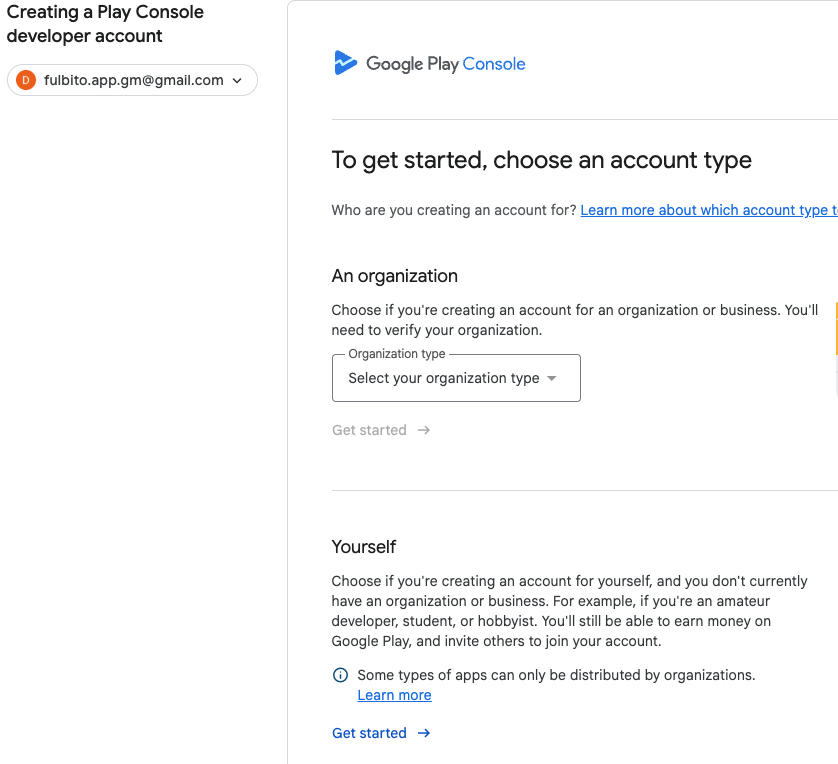
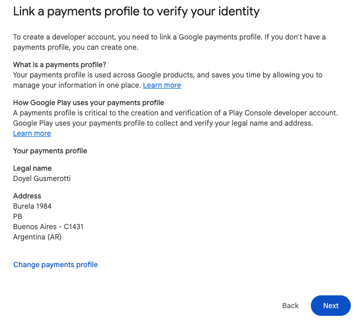
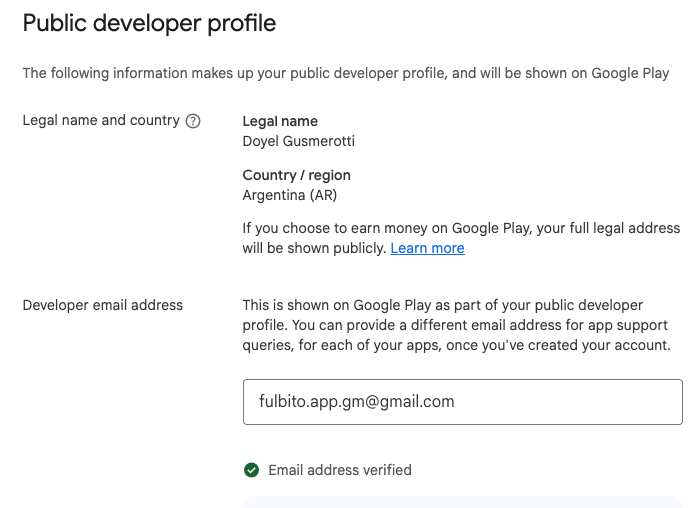
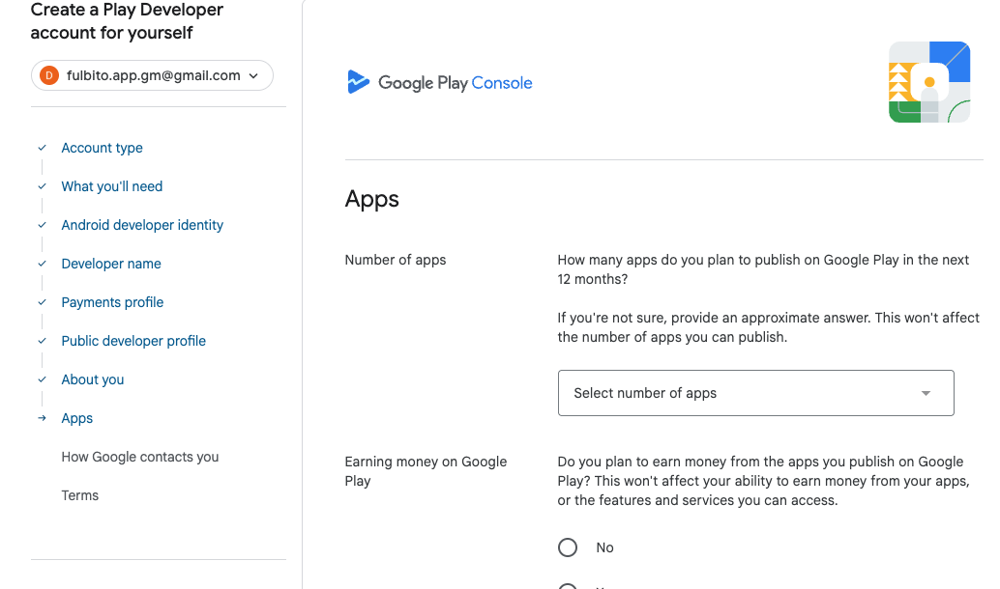
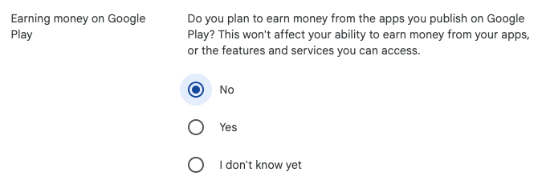

# Google Play Developer Account Registration

> **Document preview:** To preview this Markdown document in Visual Studio Code, press `Ctrl + Shift + V`.

This guide explains how to create a Google Play Console developer account. This account is required to publish and manage Android applications on the Google Play Store.

## 1. Open the Google Play Console registration page

Go to the following page:

https://play.google.com/console/signup

Sign in with the Google Account that will be used to manage the application.

We recommend using a dedicated account that can be safely maintained by the application owner or development team.

## 2. Select the account type

Google will ask whether the developer account is being created for personal use or on behalf of an organization.

For this project, select **Personal account**.

The primary difference between these options is the information and documentation required during the verification process.

An organization account normally requires additional legal and business information. Select it only when the developer account must belong to a legally registered company or organization.

> **Important:** Select the account type carefully. Google may require identity or organization verification before applications can be published.

## 3. Enter the developer name

Enter the developer name that will be displayed publicly on the Google Play Store.

Users will see this name when they visit the application listing or need to identify its developer.

The developer name can be changed later from the Google Play Console settings.

## 4. Create or select a Google Payments profile

Because applications can generate revenue through purchases, subscriptions, or other monetization methods, Google may require a Google Payments profile.

The payments profile is used to:

- Pay Google developer-related charges.
- Receive payments generated by the applications.
- Store billing and transaction information.
- Maintain a record of purchases and payments associated with the account.

Complete the requested billing and payment information.

> **Important:** Keep a secure record of the Google Payments profile ID and any payment confirmation or transaction ID generated during the registration process. Do not include sensitive payment information in the project repository.

## 5. Complete the public developer profile

Google will request additional information that may be displayed publicly on the Google Play Store.

Depending on the account and current Google Play requirements, this information may include:

- Developer name.
- Contact email address.
- Contact phone number.
- Developer website.
- Business or personal address.

Make sure the public contact information is valid and regularly monitored because Google Play users may use it to contact the developer.

## 6. Answer the application-related questions

Google will ask several questions about the applications that will be published using this developer account.

Provide accurate information about the expected use of the account and the types of applications you plan to publish.

These questions may include:

- Your previous experience with Google Play Console.
- The number of applications you expect to publish.
- The type or category of the applications.
- Whether the applications will generate revenue.
- How the applications will be distributed.

The questions displayed may vary depending on the selected account type and Google’s current verification requirements.

## 7. Accept the terms and conditions

Before continuing to the payment screen, carefully review the Google Play Console terms and conditions.

Accept the required agreements to proceed.

By accepting these terms, the account owner agrees to follow Google Play’s policies, developer rules, content requirements, and distribution conditions.

## 8. Complete the payment and verification process

After accepting the terms and conditions, continue to the payment screen and follow Google’s instructions.

After payment, Google may require additional steps before activating the account, such as:

- Email verification.
- Phone number verification.
- Identity verification.
- Address verification.
- Device verification or testing requirements.

The registration is complete only after Google has approved the account and access to the Google Play Console has been enabled.

> **Note:** Account verification may not be immediate. Google may request additional documentation or information before applications can be published.
