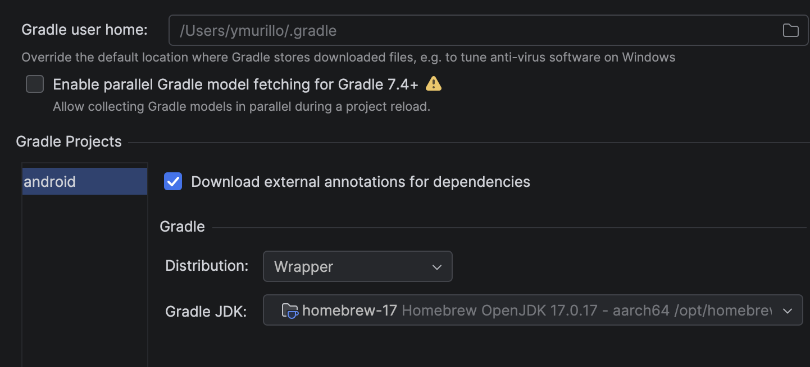
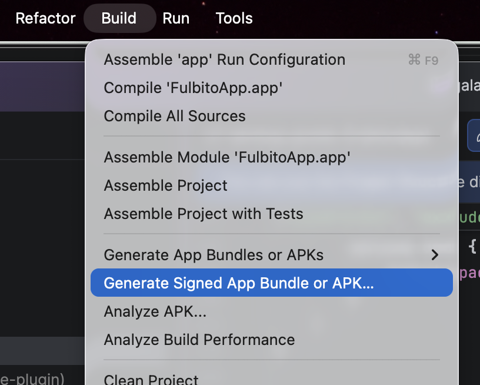
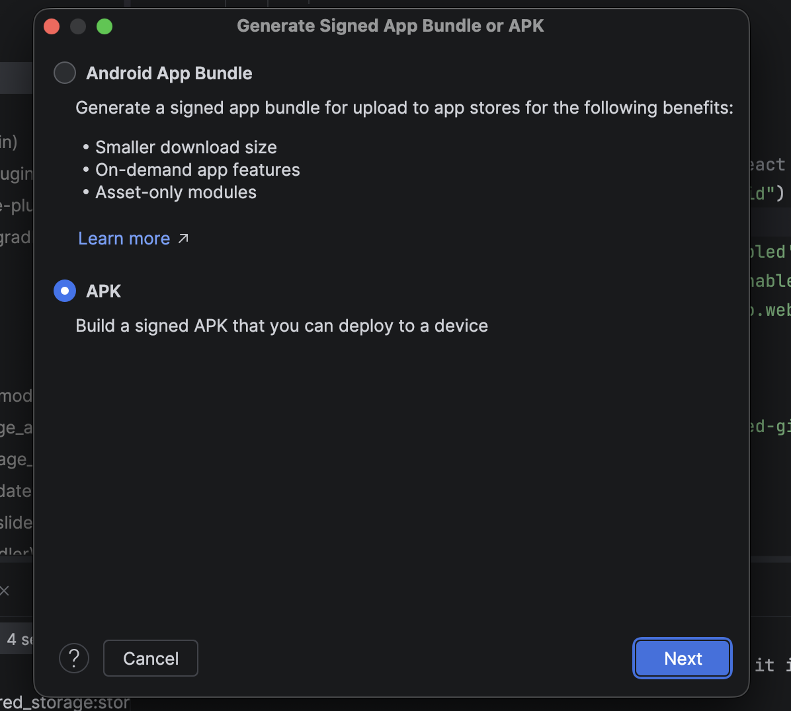
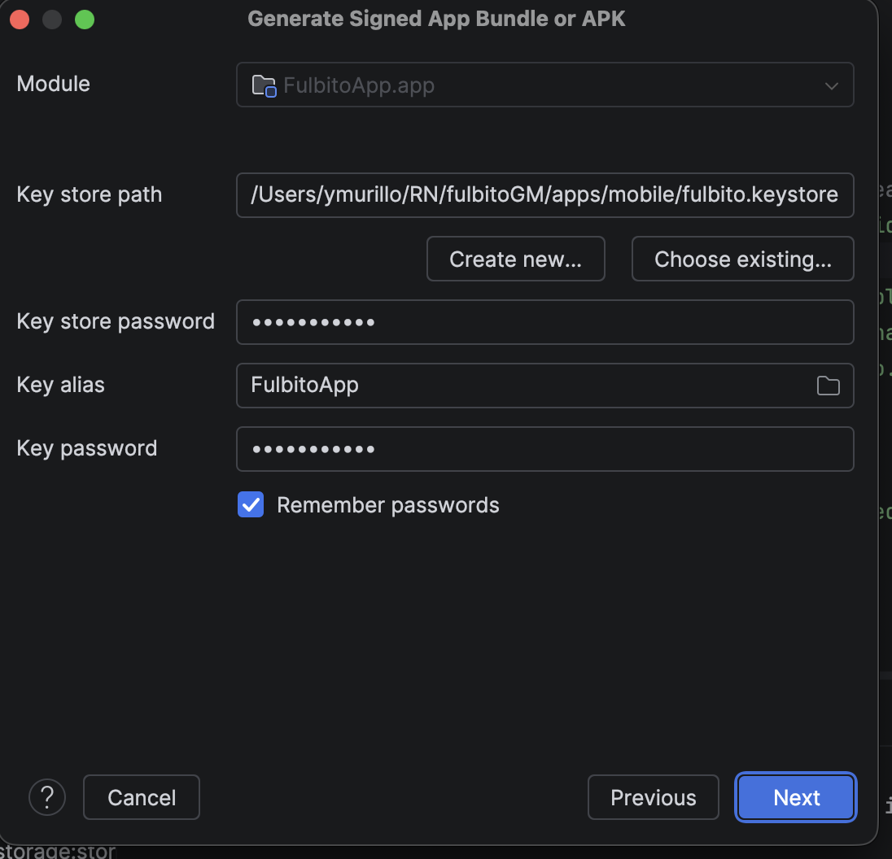
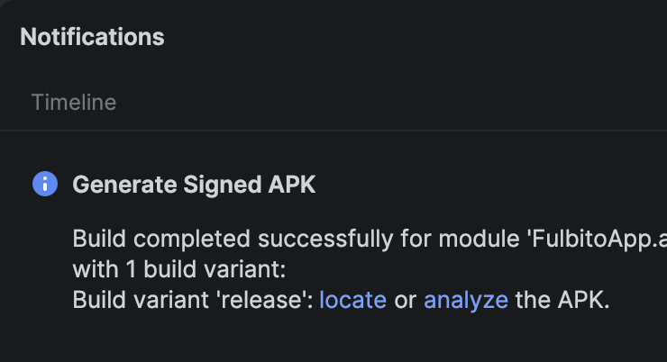

# Google Play Developer Account Registration

> **Document preview:** To preview this Markdown document in Visual Studio Code, press `Ctrl + Shift + V`.

This guide explains how to create a Google Play Console developer account. This account is required to publish and manage Android applications on the Google Play Store.

## 1. Open the Google Play Console registration page

Go to the following page:

https://play.google.com/console/signup

Sign in with the Google Account that will be used to manage the application.

We recommend using a dedicated account that can be safely maintained by the application owner or development team.

## 2. Select the account type

Google will ask whether the developer account is being created for personal use or on behalf of an organization.

For this project, select **Personal account**.


The primary difference between these options is the information and documentation required during the verification process.

An organization account normally requires additional legal and business information. Select it only when the developer account must belong to a legally registered company or organization.

> **Important:** Select the account type carefully. Google may require identity or organization verification before applications can be published.

## 3. Enter the developer name

Enter the developer name that will be displayed publicly on the Google Play Store.


Users will see this name when they visit the application listing or need to identify its developer.

The developer name can be changed later from the Google Play Console settings.

## 4. Create or select a Google Payments profile

Because applications can generate revenue through purchases, subscriptions, or other monetization methods, Google may require a Google Payments profile.

The payments profile is used to:

- Pay Google developer-related charges.
- Receive payments generated by the applications.
- Store billing and transaction information.
- Maintain a record of purchases and payments associated with the account.


Complete the requested billing and payment information.

> **Important:** Keep a secure record of the Google Payments profile ID and any payment confirmation or transaction ID generated during the registration process. Do not include sensitive payment information in the project repository.

## 5. Complete the public developer profile

Google will request additional information that may be displayed publicly on the Google Play Store.


Depending on the account and current Google Play requirements, this information may include:

- Developer name.
- Contact email address.
- Contact phone number.
- Developer website.
- Business or personal address.

Make sure the public contact information is valid and regularly monitored because Google Play users may use it to contact the developer.

## 6. Answer the application-related questions

Google will ask several questions about the applications that will be published using this developer account.


Provide accurate information about the expected use of the account and the types of applications you plan to publish.

These questions may include:

- Your previous experience with Google Play Console.
- The number of applications you expect to publish.
- The type or category of the applications.
- Whether the applications will generate revenue.
- How the applications will be distributed.

The questions displayed may vary depending on the selected account type and Google’s current verification requirements.

## 7. Accept the terms and conditions

Before continuing to the payment screen, carefully review the Google Play Console terms and conditions.


Accept the required agreements to proceed.

By accepting these terms, the account owner agrees to follow Google Play’s policies, developer rules, content requirements, and distribution conditions.

## 8. Complete the payment and verification process

After accepting the terms and conditions, continue to the payment screen and follow Google’s instructions.

After payment, Google may require additional steps before activating the account, such as:

- Email verification.
- Phone number verification.
- Identity verification.
- Address verification.
- Device verification or testing requirements.

The registration is complete only after Google has approved the account and access to the Google Play Console has been enabled.

> **Note:** Account verification may not be immediate. Google may request additional documentation or information before applications can be published.

# Android App Configuration and Signing

## 1. Create the Android signing keystore

To create the keystore that will be used to sign the Android application, run the following command in the terminal:

```bash
keytool -genkeypair \
  -v \
  -storetype JKS \
  -keyalg RSA \
  -keysize 2048 \
  -validity 10000 \
  -alias FulbitoApp \
  -keystore fulbito.keystore
```

The command will ask you to enter:

- A keystore password.
- Your name and organizational information.
- A password for the key alias.

This process should normally be completed only once. The generated keystore must be used for every release of the same application because Android updates must be signed with the correct signing identity.

> **Important:** Store the keystore, alias, and passwords in a secure password manager or secrets-management system. Never commit the keystore or its credentials to the Git repository, and never include passwords in this documentation.

> **Warning:** Losing the keystore or its credentials may prevent the team from publishing future application updates. Keep at least one secure backup managed by the project administrators.

Add the keystore filename to `.gitignore`:

```gitignore
*.keystore
*.jks
```

## 2. Troubleshoot a missing `build.gradle` file

If Android Studio cannot build the project because the `android/build.gradle` file does not exist, first verify whether the project uses Expo Prebuild.

For an Expo project, close Android Studio and run the following command from the project root:

```bash
npx expo prebuild --platform android
```

This command generates the native Android project when the `android` directory does not exist.

### Cleanly regenerate the Android project

If the Android project already exists but remains corrupted or cannot synchronize, it can be regenerated with:

```bash
npx expo prebuild --clean --platform android
```

Then open the generated `android` directory in Android Studio again.

> **Warning:** The `--clean` option deletes and regenerates the native project. Any manual changes made directly inside the `android` directory may be lost. Commit or back up those changes before running this command.

### Gradle installation

React Native and Expo projects normally include the Gradle Wrapper, so a global Gradle installation is usually unnecessary.

From the `android` directory, you can verify the wrapper with:

```bash
./gradlew --version
```

If the project specifically requires a global Gradle installation on macOS, it can be installed with Homebrew:

```bash
brew install gradle
```

> **Note:** Do not run `gradle init` inside an existing React Native or Expo Android project. It is intended to initialize a new Gradle project and may create files that conflict with the existing configuration.

## 3. Check the Gradle configuration in Android Studio

If the project still does not synchronize correctly:

1. Open Android Studio.
2. Open the **Settings** or **Preferences** menu.
3. Go to **Build, Execution, Deployment**.
4. Select **Build Tools → Gradle**.
5. Make sure Android Studio is using the project’s **Gradle Wrapper**.
6. Select a compatible Gradle JDK for the project.
7. Click **Sync Project with Gradle Files**.



> **Important:** Do not select an arbitrary Gradle version simply because it is considered stable. The Gradle version must be compatible with the Android Gradle Plugin used by the project, in this case, Homebrew 17.0.17 works.

## 4. Generate a signed Android build

After the project synchronizes successfully, Android Studio will provide the option to generate a signed APK or Android App Bundle.

From the Android Studio menu, select:

**Build → Generate Signed Bundle / APK**



> **Note:** Other build options may generate development or unsigned artifacts. These are useful for local testing, but they are not necessarily suitable for publication on Google Play.

## 5. Select the artifact type

Android Studio will ask which type of artifact should be generated:

- **APK:** Recommended when the application must be installed or shared directly for testing.
- **Android App Bundle (`.aab`):** Recommended for publishing the application on Google Play.

For a Google Play release, select **Android App Bundle** and click **Next**.



Google Play uses the App Bundle to generate optimized APK files for different devices and configurations.

## 6. Configure the signing credentials

On the signing configuration screen, select the `.keystore` or `.jks` file provided by the project administrators.

Enter the following information:

- **Key store path:** Location of the keystore file.
- **Key store password:** Password assigned to the keystore.
- **Key alias:** Alias used when the key was created.
- **Key password:** Password assigned to the key alias.



You may enable **Remember passwords** if the computer is secure and used only by an authorized developer.

> **Security note:** Do not enable this option on a shared or public computer.

Click **Next**, select the `release` build variant, and continue with the build process.

## 7. Locate the generated file

If the build completes successfully, Android Studio will display a notification indicating that the signed APK or App Bundle was generated.



Click **Locate** in the notification to open the directory containing the generated file.

The output is commonly located in one of the following directories:

For an Android App Bundle:

```text
android/app/build/outputs/bundle/release/app-release.aab
```

For an APK:

```text
android/app/build/outputs/apk/release/app-release.apk
```

The `.aab` file can then be uploaded to the appropriate release section in Google Play Console.
